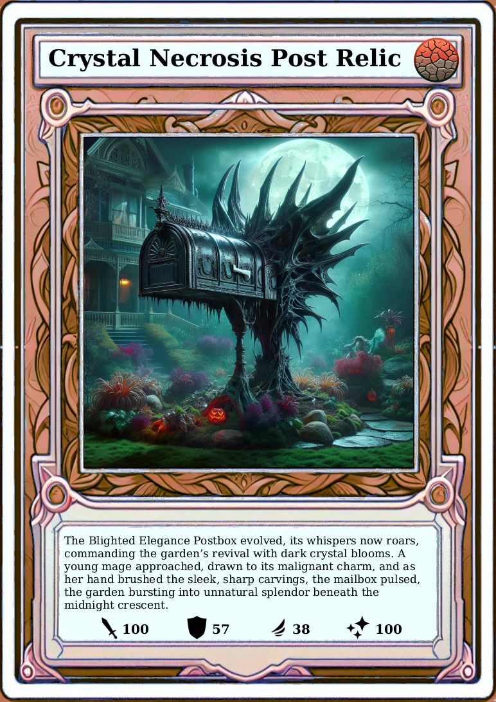

tr<b>AI</b>ding-cards

An AI generated trading card game.

<a href="">This project was part of the 2023 Digital Science Night</a>

DiffusionBooth | tr<b>AI</b>ding-cards | <a href="https://github.com/okafke/trAIding-cards-gallery">tr<b>AI</b>ding-cards-gallery</a>

Are 151 Pokémon not enough for you? Ever wanted to see what a hungry fridge on fire looks like? A demonic post box? Or the Kitchen Mixer Overlord? Let your imagination run wild:

<!DOCTYPE html>
<html lang="en">
<head>
  <meta charset="UTF-8">
  <meta name="viewport" content="width=device-width, initial-scale=1.0">
  <title>Image Alignment</title>
  
</head>
<body>

  
  
  
  
  
  

</body>
</html>