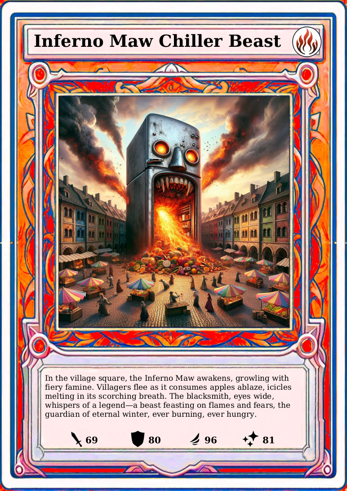

<h1 align="center" style="font-weight: normal;">tr<b>AI</b>ding-cards</h1>
<p align="center">An AI generated trading card game.</p>
<p align="center"><a href="">This project was part of the 2023 Digital Science Night</a></p>
<p align="center">DiffusionBooth | tr<b>AI</b>ding-cards | <a href="https://github.com/okafke/trAIding-cards-gallery">tr<b>AI</b>ding-cards-gallery</a></p>

<p style="text-align: center;">
Are 151 Pokémon not enough for you?
Ever wanted to see what a hungry fridge on fire looks like?
A demonic post box?
Or the Kitchen Mixer Overlord? 
Let your imagination run wild: tr<b>AI</b>ding-cards uses Dall-E and ChatGPT to create cards for you.
</p>

<p align="center">
    
    
    
</p>

<p align="center">
    
    
    
</p>

## Setup
> Note that lots of the code in this repository is still written with the Digitial Science Night in mind.
> E.g. that includes lots of the specific printer code and printer ips.

Clone the repository. Create a file called `env.properties` in [src/main/resources](src/main/resources) and add your
OpenAI API key:
```properties
OPEN_AI_API_KEY=<your OpenAI key>
```
Then execute:
```
./gradlew bootRun
```
Visit [http://localhost:8080](http://localhost:8080).
Start creating cards :)
