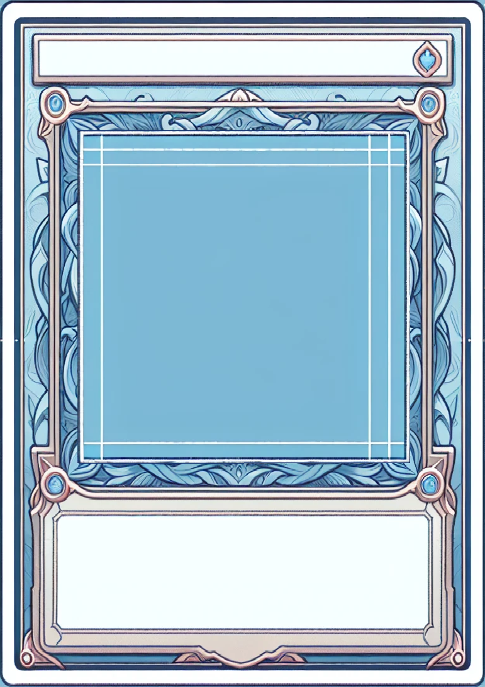

# Card templates
I attempted to create a template for my cards with Dall-E-3 (vivid), but I was not too happy with the results:

So next I attempted to create ornaments for a card:

I was not happy with those results either, as I could not manage to find a way to make them "rectangly" enough.
But a last attempt got me a quite usable template:

Which I then dilettantically resized to fit a Din A7 format with a square in the middle for the image:

